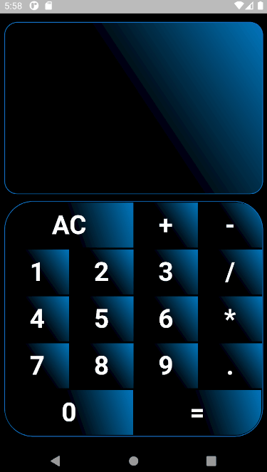

# Calculator App

## Sobre o Projeto:
Projeto visa praticar a conceitos de estilização de botões, layout e lógica de programação.

  

## Requisitos
- Flutter versão: 2.2.2
- Channel: stable
- Dart: 2.13.3 (stable)

